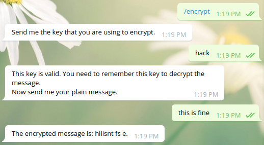
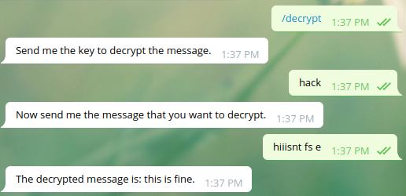

# Crypt It!
Want to encrypt messages to be sent safely?
Set your own key and encrypt the message. Also, you can use the same key to decrypt the message back! 

### Encryption Example

### Decryption Example

